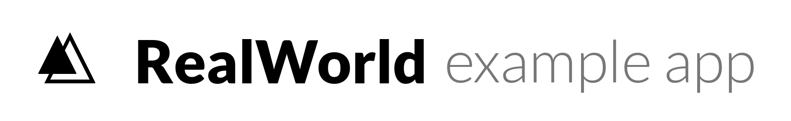

# 

> ### Adonis codebase containing real world examples (CRUD, auth, advanced patterns, etc) that adheres to the [RealWorld](https://github.com/gothinkster/realworld) spec and API.


This codebase was created to demonstrate a fully fledged fullstack application built with **Adonis** including CRUD operations, authentication, routing, pagination, and more.

We've gone to great lengths to adhere to the **Adonis** community styleguides & best practices.

For more information on how to this works with other frontends/backends, head over to the [RealWorld](https://github.com/gothinkster/realworld) repo.


# Getting started

Clone the repository
```bash
git clone git@github.com
```

Install dependencies
```bash
npm install
```

Copy the example env file and make the required configuration changes in the .env file
```bash
cp .env.example .env
```

Generate a new application key
```bash
npx adonis key:generate
```

Run migration
```bash
node ace migration:run
```

Start the local development server
```bash
npm run dev
```

Run tests
```bash
npm test
```

  For more information run
```bash
node ace --help
```
[adonisjs.com](http://adonisjs.com)

## API Specification

This application adheres to the api specifications set by the [Thinkster](https://github.com/gothinkster) team. This helps mix and match any backend with any other frontend without conflicts.

> [Full API Spec](https://github.com/gothinkster/realworld/tree/master/api)

More information regarding the project can be found here https://github.com/gothinkster/realworld

## Environment variables

`.env` - Environment variables can be set in this file

***Note*** : You can quickly set the database information and other variables in this file and have the application fully working.
